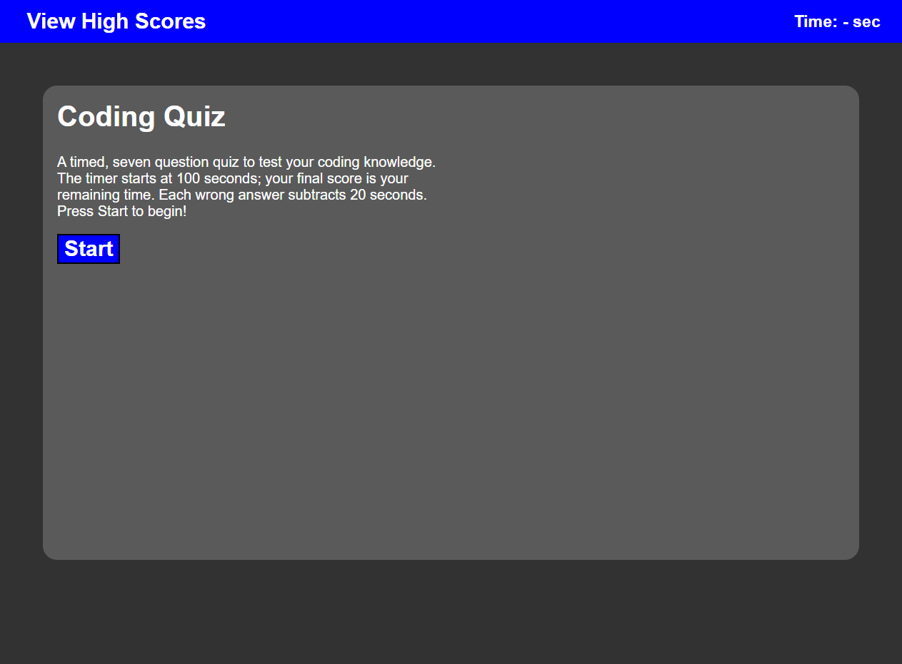
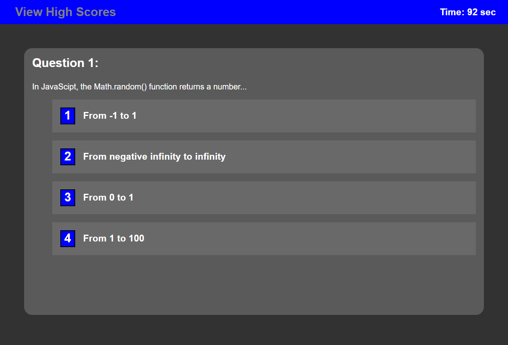
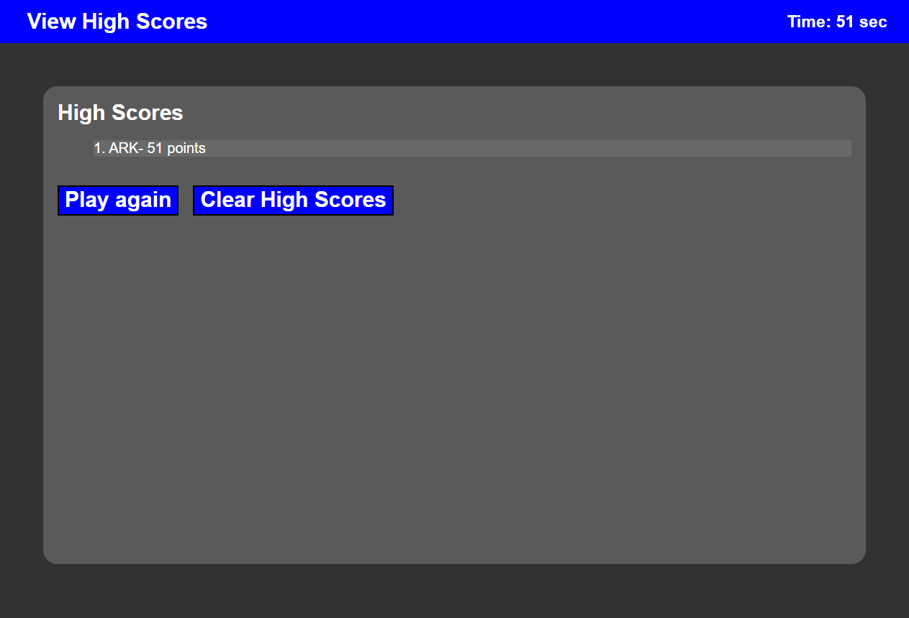

# Coding Quiz

This project uses Javascript to create a short, multiple-choice coding quiz and stores high scores in local storage. The website dynamically creates elements that are responsive to user actions to create and proceed through the quiz. Both the order of the questions and order of the answers are randomized. The quiz has a time constraint that also functions as the game's score; incorrect answers subract from the time. After the score is over, the user can enter their name and their score is stored in local storage. Stored high scores can be displayed by clicking on the High Scores button in the heading, which is disabled while the game is running.

## Installation

N/A

## Usage

[Live website](https://aknoedler.github.io/coding-quiz/)

Click the start button to begin the quiz, or visit the High Score page by clicking the button in the upper left.

## Screenshots

Starting Screen

A question page

High Score screen

## Contributing

N/A

## License

N/A